# GCP Project Configuration

This document outlines how to configure a GCP project for use by the backend API. 

# Google Oauth

To make this process easier, you may want to consider logging out of any other google accounts you might be signed in with.

## Select Project

1. Navigate to [https://console.cloud.google.com/](https://console.cloud.google.com/)
2. Select the desired GCP Project

## Consent Screen

1. Navigate to [https://console.cloud.google.com/apis/credentials/consent](https://console.cloud.google.com/apis/credentials/consent)
2. Choose External and click Create
    
    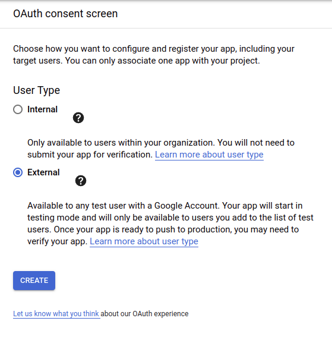
    
3. Enter the App Name the same as Project Name, and select a User Support Email
    
    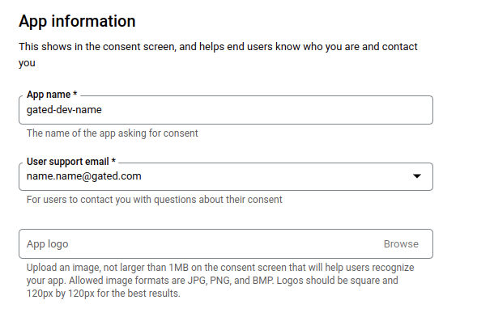
    
4. Enter `gated-dev-name.firebaseapp.com`  as an Authorized Domain and a Developer Email
    
    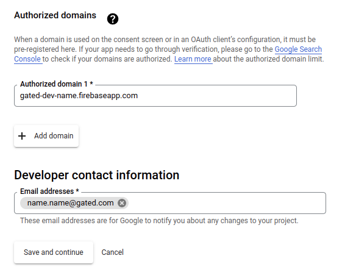
    
5. Click Save and Continue and then Add or Remove Scopes
    
    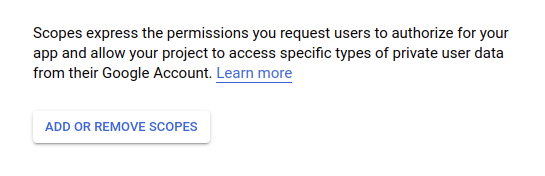
    
6. Add scopes
    1. Paste the following text in the Manually Add Scopes box
        
        ```
        [openid](https://www.googleapis.com/openid), [https://www.googleapis.com/auth/userinfo.profile](https://www.googleapis.com/auth/userinfo.profile), [https://www.googleapis.com/auth/gmail.modify](https://www.googleapis.com/auth/gmail.modify)
        ```
        
    2. Click Add to Table, then Update, then Save and Continue
        
        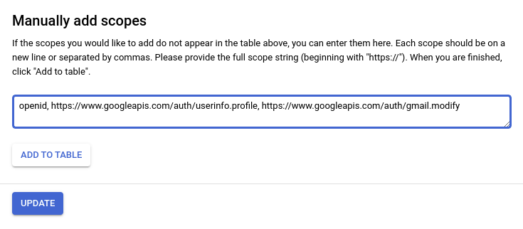
        
7. Click Add Users and enter the emails that will be able to sign up on your local environment
    
    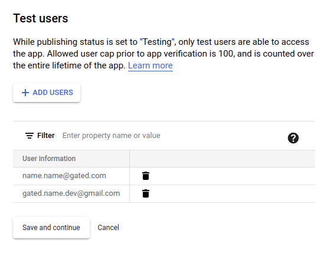
    

## Oauth Client ID and Secret

1. Navigate to [https://console.cloud.google.com/apis/credentials](https://console.cloud.google.com/apis/credentials)
2. Click Create Credentials > OAuth Client ID
    
    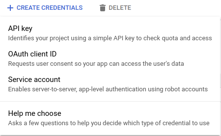
    
3. Select “Web application” as the Application Type and enter your Project Name as the Name
    
    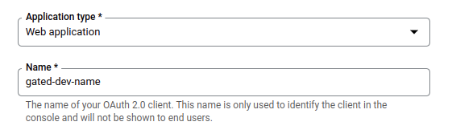
    
4. Enter the following as an Authorized JavaScript Origin:
`http://localhost:8080`
    
    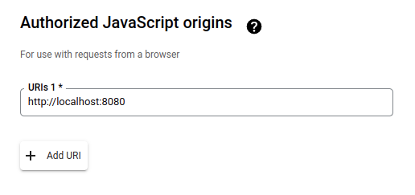
    
5. Enter the following Authorized Redirect URIs and click Save:
`http://localhost:3000/api/user/auth/login`
`http://localhost:3000/api/user/auth/migration`
`http://localhost:3000/api/user/auth/signup`
`http://localhost:3000/api/connection/reauthorize`‪
    
    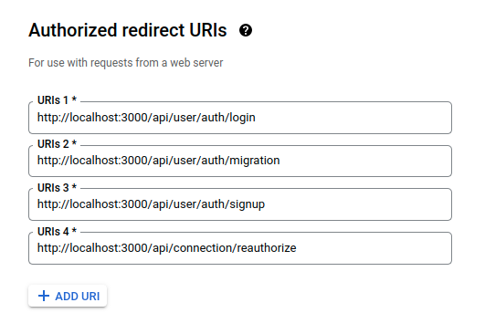
    
6. Copy the Client ID and Secret to `GOOGLE_CLIENT_ID` and `GOOGLE_CLIENT_SECRET`  in .env
    
    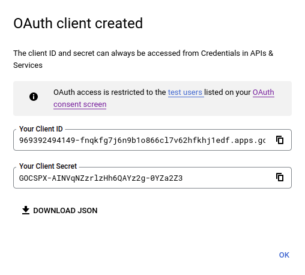
    

## Key Ring

1. Follow the [Enable the KMS API](https://console.cloud.google.com/flows/enableapi?apiid=cloudkms.googleapis.com&redirect=https://console.cloud.google.com/security/kms/keyrings) flow
    
    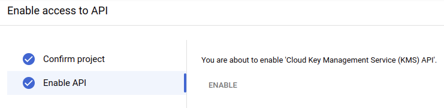
    
    <aside>
    ⚠️ If you are prompted to enable billing, reach out to an administrator to enable billing for your project.
    
    </aside>
    
2. Navigate to [https://console.cloud.google.com/security/kms/keyrings](https://console.cloud.google.com/security/kms/keyrings)
3. Click Create Key Ring
    1. Enter a Key Ring Name e.g. “keyring”
    2. Ensure the Locaiton is “Multi-region” > "global (Global)”, which is the default
    3. Click Create
    
    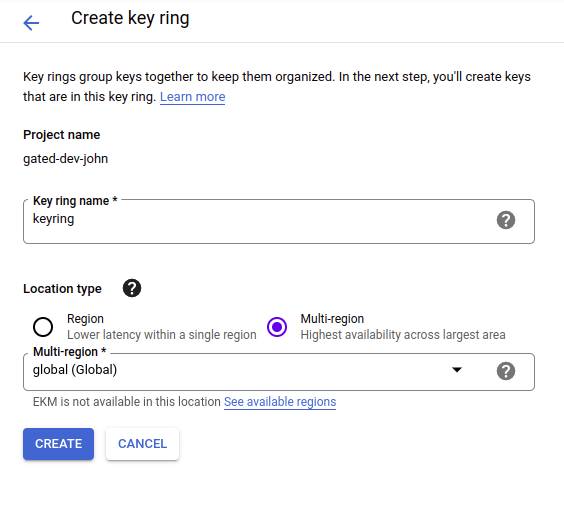
    
4. Create Key
    1. Enter a Key Name e.g. “development”
    2. Select Key Rotation Period “Never (manual rotation)”
    3. Click Create
    
    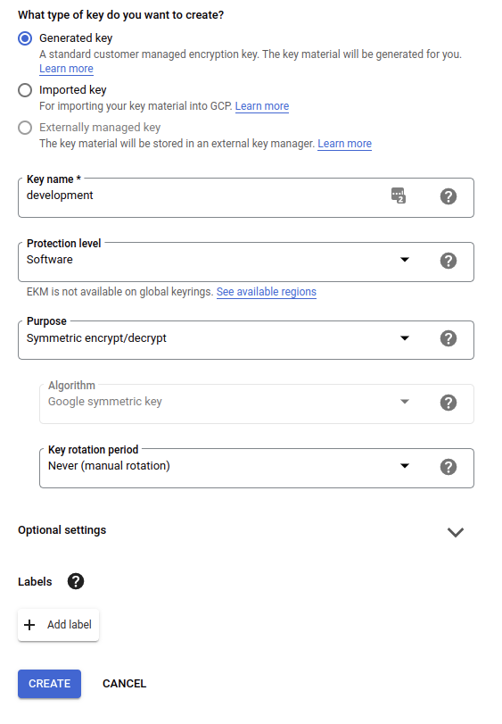
    

## Tenant

<aside>
⚠️ You may need to enable Identity Platform as well as allow multi-tenancy under security settings under Identity Platform.

</aside>

1. Navigate to [https://console.cloud.google.com/customer-identity/tenants](https://console.cloud.google.com/customer-identity/tenants)
2. Click Add Tenant
    1. Enter a Tenant Name, e.g. “gated-dev”
    2. Click Save
        
        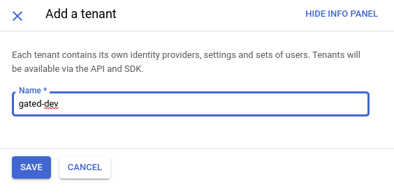
        
3. Set the `AUTH_TENANT` in .env, e.g. `AUTH_TENANT=gated-dev-asdf1`
    
    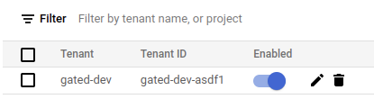
    
4. Add identity provider for Googlei

## Service Account

1. Navigate to [https://console.cloud.google.com/apis/credentials](https://console.cloud.google.com/apis/credentials)
2. Click Create Credentials > Service Account
    
    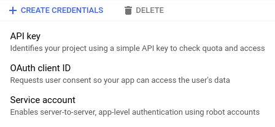
    
3. Enter the Project Name as the Service Account Name and click Create and Continue
    
    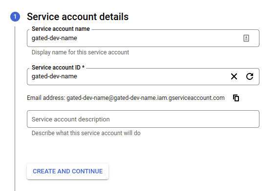
    
4. Click Continue and Done to return to [https://console.cloud.google.com/apis/credentials](https://console.cloud.google.com/apis/credentials)
5. Click the pencil icon to edit the service account
    
    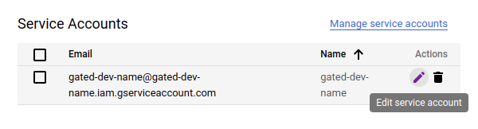
    
6. Click Keys > Add Key > Create New Key 
    
    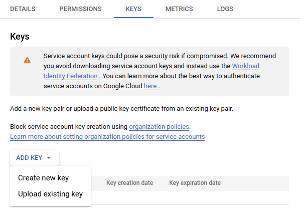
    
7. Select JSON and click Create
    
    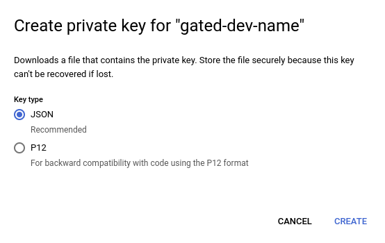
    
8. Save the .json file
9. Duplicate the file into the nestjs folder and rename it to cred.json
10. In the .env file, update `GOOGLE_APPLICATION_CREDENTIALS` to the full path of cred.json
e.g. `GOOGLE_APPLICATION_CREDENTIALS=/home/name/workspace/nestjs/cred.json`

## Add Security Principal For Service Account

1. Go to IAM
2. Select Permissions then click +Add
3. Start typing name of services client name like ‘gated-dev-name’. Auto-completion should show your list of services clients. Select your client.

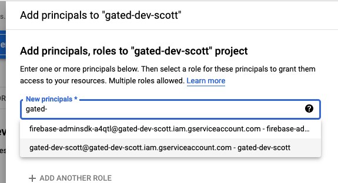

1. Select roles:  `Owner` and `Pub/Sub Edit`
2. you should have a new ‘principal’ listed

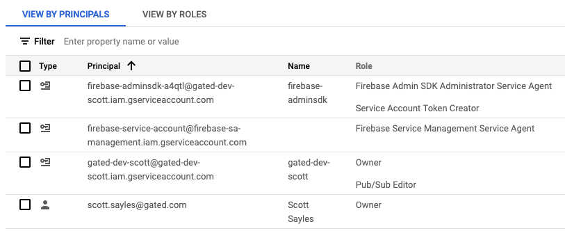


## Allow for Full Email Flow (Optional)

If you’d like to enable the entire email flow from your local, gmail api needs to be allowed to push notifications to our gmail-push-notifications topic. To do that

1. open the settings for the topic in the google console.
2. view “Permissions” on the right hand tab
3. Click “+ADD PRINCIPAL”
4. for “New principal”, enter [gmail-api-push@system.gserviceaccount.com](mailto:gmail-api-push@system.gserviceaccount.com) 
    1. this is a special principal that gmail uses 
5. assign pub/sub publisher role